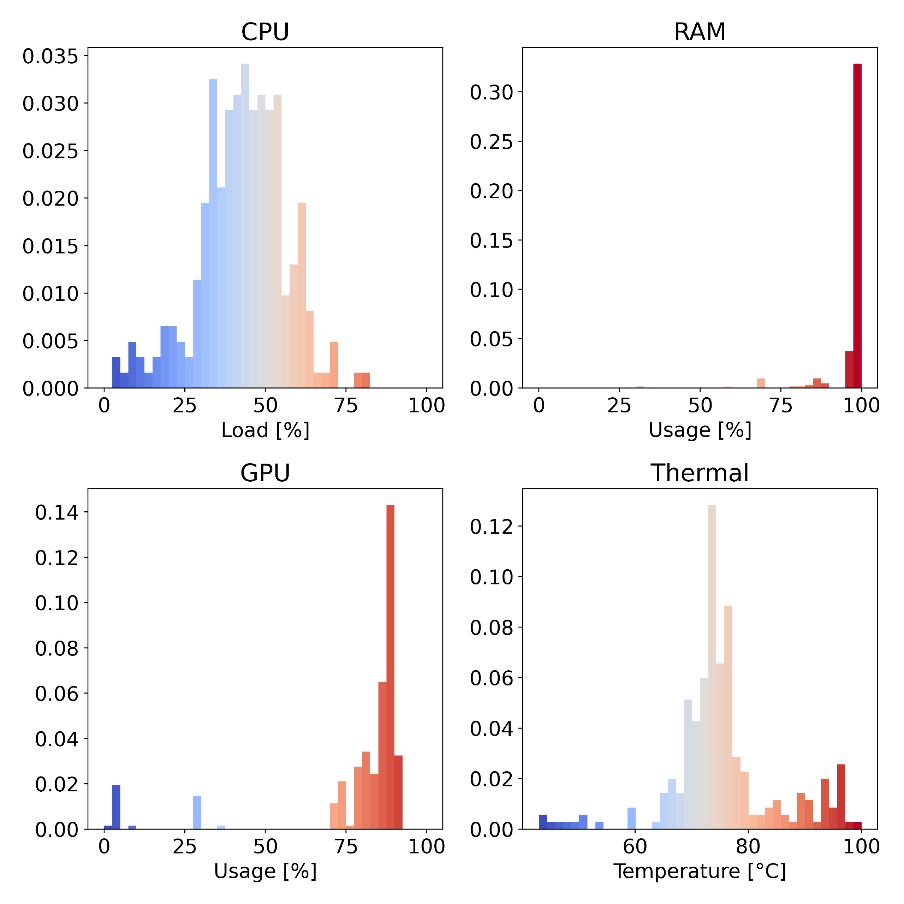

# Hardware telemetry
A collection of Bash scripts that monitor hardware metrics, including CPU load, temperature, RAM/SWAP usage, and optionally, NVIDIA GPU usage (using nvidia-smi). Data is temporarily stored and shared privately through a Dockerized Telegram API call written in Python.

## Configuration
Require two configuration files. The file `.config` contains a single `int` specifying the thermal zone where CPU temperature is collected. For x86 architectures, this information can be retrieved by inspecting which sensor has type `x86_pkg_temp` after running
```bash
cat /sys/class/thermal/thermal_zone*/type
```
and save its value in `.config`. The file `secrets.json` contains the Telegram ChatID and Bot API used by `data2api.py`, with template
```json
{
    "chatID": "-12345",
    "token": "12345:ABCDE"
}
```
For instruction on creating and maintaining a Telegram Bot, check [BotFather](https://core.telegram.org/bots/tutorial). For security implications, never commit `secrets.json`.

## Example
The telemetry script (Bash) can natively run on the system. The Telegram communication (Python) is containerized in rootless [Docker](https://docs.docker.com/) by first running `./build.sh`. Start collecting data by running
```bash
./telemetry.sh [OPTIONS]
    # [OPTIONS]
    # -t, --timestep <seconds> Set the timestep in seconds (default: 30)
    # --nogpu                  Disable GPU monitoring
```


## Structure
The repository has the following structure
```bash
build.sh            # Builds the Docker image
requirements.txt    # Python dependencies
data2api.py	    # Data analysis and Telegram API call (containerized)
telemetry.sh        # Metrics collection and container call
```
